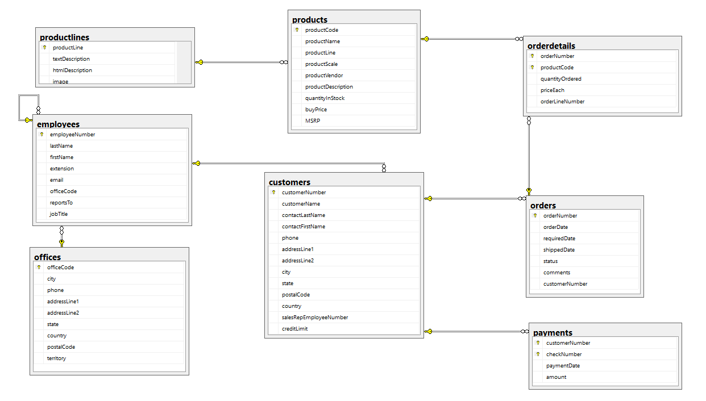
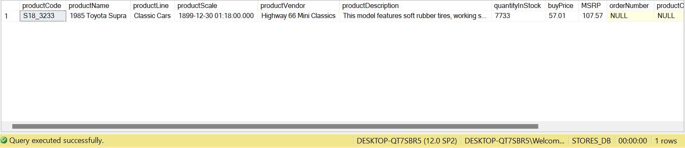
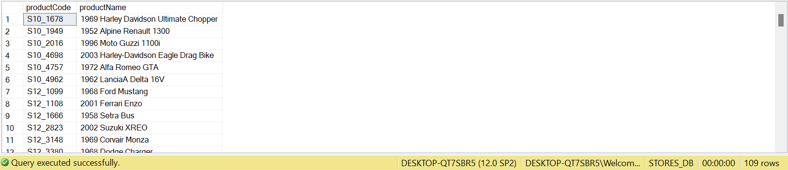
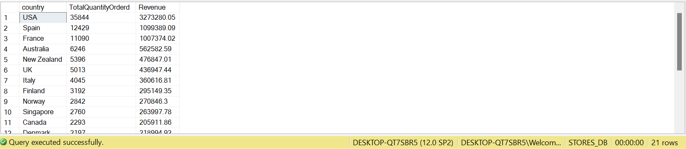
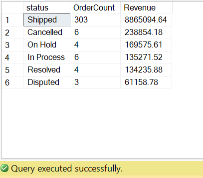
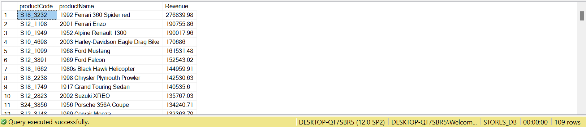
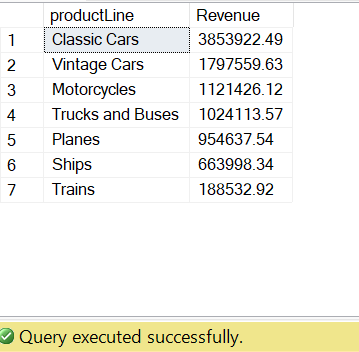
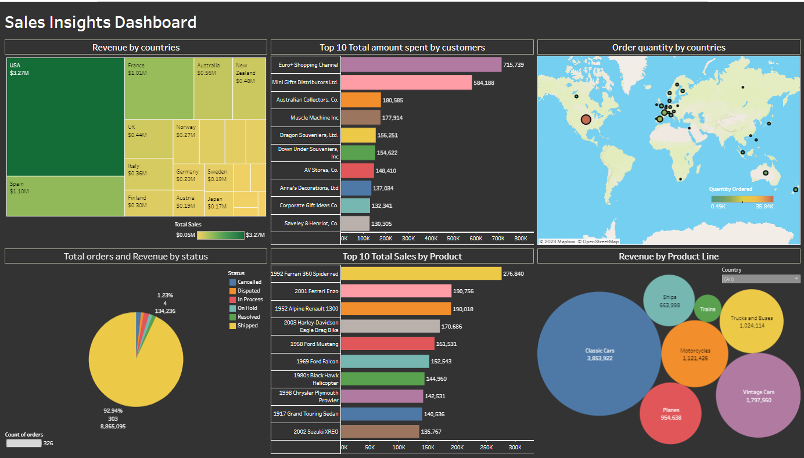

Sale Insights Data Analysis using SQL and Tableau

Author: Muhammad Adnan

<h2 style='color:blue'>Table of Contents 📋 </h2>
🚀 1. Setting up and database structure
📊 2. Using SQL analysis
📈 3. Analysis
🎨 4. Tableau Dashboard
1. Setting up and database structure
1.1 Setting up

Open Sale Analysis.sql file in the SQL server or your SQL development kit.

Add the Dataset 'stores.xlsx' to the database and run the code.

1.2 Database structure

2. Using SQL analysis

To utilize SQL analysis for conducting sales data analysis, follow these steps:

Launch your preferred SQL client and connect with the database where you have imported the sales data.

Familiarize yourself with the SQL scripts available in the repository. These scripts encompass different facets of sales data analysis, including data cleansing, segmentation, and RFM analysis.

Employ the SQL queries within your SQL client to carry out the desired analysis.

Evaluate the outcomes and extract valuable insights from the sales data.

3. Analysis

Here are some analyses I used in this repository:

Items have not been ordered

select * from products P
left join orderdetails O
on P.productCode=O.productCode
where O.productCode is null

Output:

Items ordered at least once

select distinct P.productCode, P.productName 
from products P inner join orderdetails O 
on P.productcode=O.productCode

Output:

Order quantity and Revenue by countries

select c.country, sum(od.quantityOrdered) as TotalQuantityOrderd, sum(od.quantityOrdered*od.priceEach) as Revenue
from customers c inner join orders o
on c.customerNumber=o.customerNumber
inner join orderdetails od
on o.orderNumber=od.orderNumber
group by c.country
order by TotalQuantityOrderd desc

Output:

Total orders and Revenue per status

select o.status, count(distinct o.orderNumber) as OrderCount, sum(od.quantityOrdered * od.priceEach) AS Revenue
from orders o
inner join orderdetails od
on o.orderNumber = od.orderNumber
group by o.status
order by Revenue desc

Output:

Revenue by Product

select P.productCode, P.productName, sum(od.quantityOrdered * od.priceEach) as Revenue
from products P inner join orderdetails od
on P.productCode=od.productCode 
group by P.productCode, P.productName
order by Revenue desc

Output:

Revenue by product line

select p.productLine, sum(od.quantityOrdered * od.priceEach) AS Revenue
from products p
inner join orderdetails od
on p.productCode = od.productCode
group by p.productLine
order by Revenue desc

Output:

Who is the best customer? (Using RFM analysis)

with rfm as (
    select
        o.customerNumber,
        max(o.orderDate) as last_order_date,
        count(o.orderNumber) as Frequency,
		sum(od.quantityOrdered * od.priceEach) as MonetaryValue,
        sum(od.quantityOrdered * od.priceEach) / count(o.orderNumber) as AvgMonetaryValue,
		(select max(orderDate) from orders as max_order_date) as max_order_date,
		datediff(dd, max(o.orderDate), (select max(orderDate) from orders)) as Recency
    from orders o
    inner join orderdetails od on o.orderNumber = od.orderNumber
    group by o.customerNumber
),
rfm_calc as ( 
	select 
		r.*, 
		ntile(4) over (order by last_order_date) as rfm_recency,
		ntile(4) over (order by Frequency) as rfm_frequency,
		ntile(4) over (order by MonetaryValue) as rfm_monetary
	from rfm r
)
select 
	c.customerName, rfm.*,
	(case
		when rfm_recency = 4 and rfm_frequency >= 3 and rfm_monetary >= 3 then 'Loyal Customers'
        when rfm_recency >= 3 and rfm_frequency >= 3 and rfm_monetary >= 2 then 'Active'
		when rfm_recency >= 2 and rfm_frequency >= 1 and rfm_monetary >= 2 then 'Potential Customers'
		when rfm_recency >= 3 and rfm_frequency >= 1 and rfm_monetary = 1 then 'New Customers'
		when rfm_recency <= 2 and rfm_frequency >= 1 and rfm_monetary >=1 then 'Lost Customers'
	 end) as rfm_segment
from rfm_calc rfm
inner join customers c 
on rfm.customerNumber=c.customerNumber
order by MonetaryValue desc

Output:

4. Tableau Dashboard

Here is a preview of the interactive dashboard created using Tableau:

